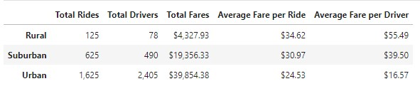

# PyBer Analysis

## Overview

The purpose of this analysis was to use data provided from a ridesharing company called PyBer, to uncover trends and patterns. Two datasets containing ride and city data were used to separate the data in relation to different city types. A multiple-line graph was created using Python with Matplotlib to visually summarize the total weekly fares for each type of city in a clear and comprehensive way.

### Purpose

Calculate the following metrics for analysis

- Total rides per city type
- Total drivers per city type
- Total fares per city type
- Average fare per ride for each city type
- Average fare per driver for each city type
- A summary DataFrame of the previous obtained data
- Multiple line plot to show the total weekly fares for each type of city

## Rideshare Analysis

The key metrics were calculated and a summary DataFrame was created:

Overall, Urban cities have the highest number of rides (1,625), drivers (2,405), and total fares ($39,854.38). This is unsuprising due to the high population density usually associated with urban cities. Suburban and Rural city types have significantly less total rides, drivers, and fares with total rides and drivers not even making up half of the total data. Urban cities bring in a higher revenue in comparison to the other city types. However, there is an inverse relationship with average fares per ride and average fare per drivers. The average fare per ride for Urban cities is $24.53 and per driver is $16.57. Rural city types have the highest average fare per ride ($34.62) and average fare per driver ($55.49). The average fare per driver is almost three times as much as urban city types. There appears to be an opportunity to increase revenue in rural city types with every ride, however rural fares could be higher due to the low available drivers in the area.
