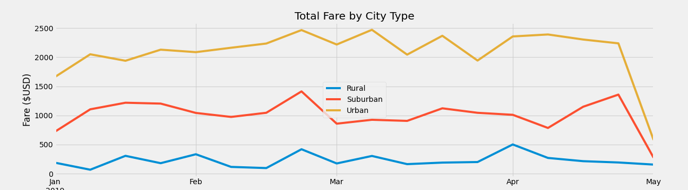

# PyBer Analysis

## Overview

The purpose of this analysis was to use data provided from a ridesharing company called PyBer, to uncover trends and patterns. Two datasets containing ride and city data were used to separate the data in relation to different city types. A multiple-line graph was created using Python with Matplotlib to visually summarize the total weekly fares for each type of city in a clear and comprehensive way.

### Purpose

Calculate the following metrics for analysis

- Total rides per city type
- Total drivers per city type
- Total fares per city type
- Average fare per ride for each city type
- Average fare per driver for each city type
- A summary DataFrame of the previous obtained data
- Multiple line plot to show the total weekly fares for each type of city

## Rideshare Analysis

The key metrics were calculated and a summary DataFrame was created:

Overall, Urban cities have the highest number of rides (1,625), drivers (2,405), and total fares ($39,854.38). This is unsuprising due to the high population density usually associated with urban cities. Suburban and Rural city types have significantly less total rides, drivers, and fares with total rides and drivers not even making up half of the total data. Urban cities bring in a higher revenue in comparison to the other city types. However, there is an inverse relationship with average fares per ride and average fare per drivers. The average fare per ride for Urban cities is $24.53 and per driver is $16.57. Rural city types have the highest average fare per ride ($34.62) and average fare per driver ($55.49). The average fare per driver is almost three times as much as urban city types. There appears to be an opportunity to increase revenue in rural city types with every ride, however rural fares could be higher due to the low available drivers in the area or the longer distance required for each ride.

The following multiple line chart was created to visualize the total weekly fares for each city type:

In the time period analyzed, the total fares for each  city type remains relatively consistent in comparison to each other. The Urban city types remains the highest in terms of total fares for the whole time period where rural cities remain the lowest. The beginning of January reports the lowest total fares for Urban city types while the last week of February and the second week of March report the highest total fares. In fact, the last week of February has the highest total fares for each city type. This outlines an increased demand overall for that week. It appears that towards the end of April all fares for all city types decline, showing a decrease in demand for the time period.

# Summary

Recommendations for addressing disparities among the city types:

- Rural cities have the least amount of rides, drivers, and the lowest total fares while having the highest average fare per ride and the highest average fare per driver. With the high average fare, increasing the usage of PyBer could potentionally aggressively increase the total revenue for this city type. However, the total number of drivers is relatively low. Increasing the use of PyBer would call for an increase in drivers. Marketing and investing in PyBer in rural city types could increase the demand and simultaneoulsy increase incentive to become a driver for these city types. Doing so would significantly increase the revenue.
- Suburban city types remains relatively in the middle between Urban and Rural city types. A more moderate approach in investing could be taken for this city type while focusing more on the other two city types.
- Urban Cities brings in the most revenue for the company and therefore should be the main focus when it comes to investing and marketing. As the best performing city type, further investment could yield an increase in revenue with a lower risk. Urban cities are more dense in population and tend to already have a demand for ride sharing. This makes marketing easier for this city type as the demand is already there. However, further analysis of Urban data is cruicial to prevent flooding the market with drivers and to keep up with competition. For example, other ride sharing apps will stop highering drivers once a certain threshold is reached.
